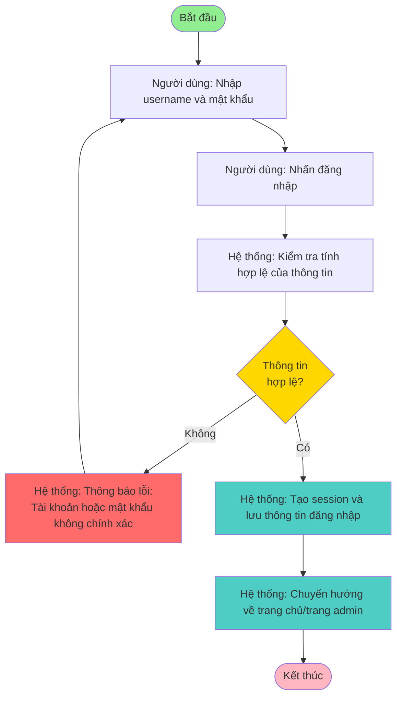
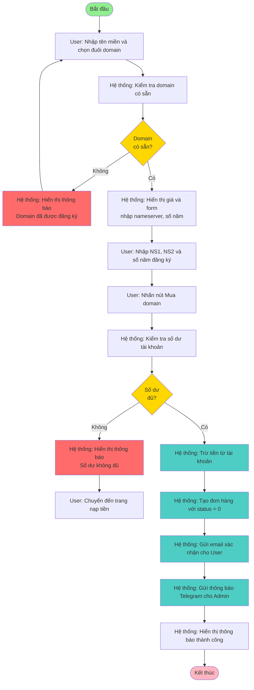
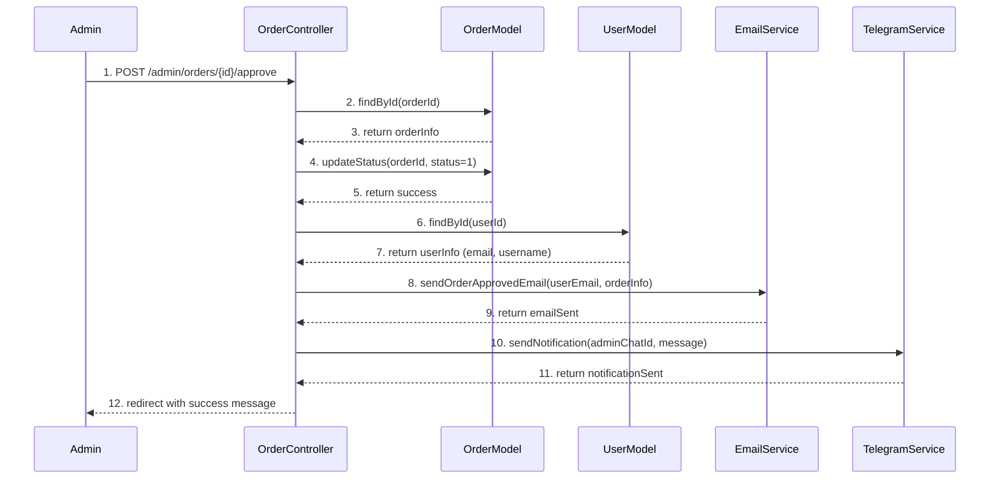
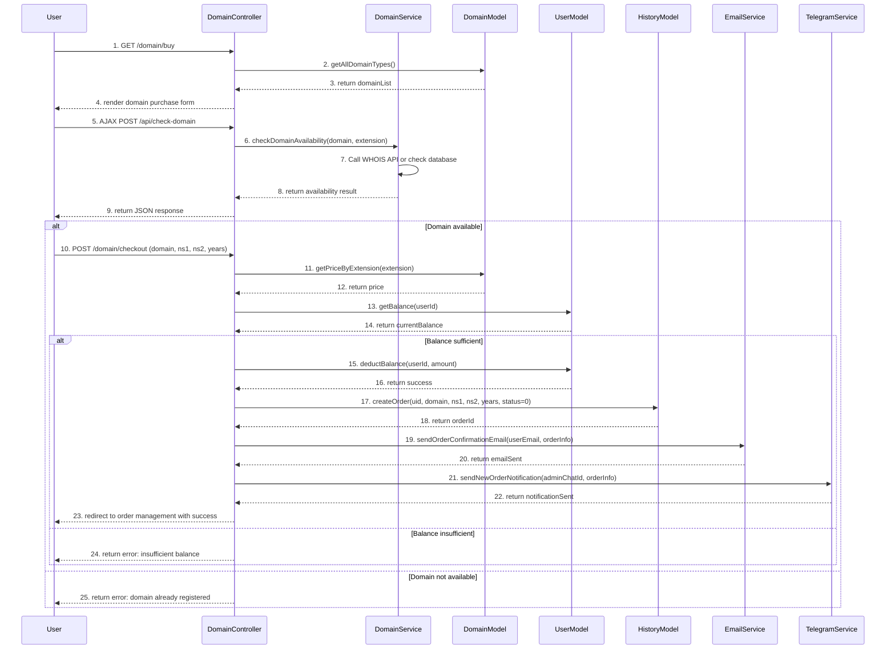

# CHƯƠNG 3. PHÂN TÍCH HỆ THỐNG VÀ XÂY DỰNG SẢN PHẨM

## 3.1. Phân tích hệ thống

Dựa trên lý do chọn đề tài và mục tiêu đề tài đạt được đã được trình bày ở chương 1, phần này xác định rõ ràng hơn về các yêu cầu cần thực hiện của đề tài. Hệ thống website cung cấp và quản lý dịch vụ số được thiết kế để giải quyết các vấn đề thực tế trong việc quản lý và bán các dịch vụ công nghệ thông tin, bao gồm tên miền, hosting, VPS và source code. Hệ thống cần đảm bảo tính tự động hóa cao, dễ sử dụng cho cả khách hàng và quản trị viên, đồng thời đảm bảo tính bảo mật và ổn định trong quá trình vận hành.

### 3.1.1. Khảo sát yêu cầu hệ thống

#### a. Tìm hiểu các hệ thống tương tự đã có

Trong quá trình nghiên cứu và phát triển đề tài, em đã tiến hành khảo sát các hệ thống tương tự đã có trên thị trường để hiểu rõ hơn về các tính năng và quy trình nghiệp vụ phổ biến. Các hệ thống được khảo sát bao gồm:

**Các nhà cung cấp dịch vụ tại Việt Nam:**
- **Nhân Hòa (Nhanhoa.com):** Hệ thống cung cấp domain, hosting, VPS với giao diện đơn giản, hỗ trợ thanh toán qua thẻ cào và chuyển khoản ngân hàng. Hệ thống có tính năng quản lý DNS, tự động hóa một phần quy trình đăng ký domain.
- **FPT (FPT Telecom):** Hệ thống lớn với nhiều dịch vụ, có tính năng quản lý đơn hàng, thống kê doanh thu, và tích hợp nhiều phương thức thanh toán.
- **Viettel IDC:** Hệ thống chuyên về hosting và VPS, có giao diện quản trị hiện đại, hỗ trợ quản lý tự động hóa cao.

**Các hệ thống quốc tế:**
- **Namecheap:** Hệ thống bán domain và hosting lớn, có tính năng kiểm tra domain real-time, quản lý DNS trực quan, và tích hợp nhiều công cụ hỗ trợ.
- **GoDaddy:** Hệ thống toàn cầu với nhiều tính năng tự động hóa, quản lý đơn hàng hiệu quả, và hỗ trợ khách hàng tốt.

**Kết quả khảo sát:**
Từ việc khảo sát các hệ thống trên, em nhận thấy các hệ thống tương tự đều có các chức năng cơ bản như:
- Đăng ký và quản lý tài khoản người dùng
- Tìm kiếm và kiểm tra tên miền (WHOIS)
- Mua các dịch vụ (domain, hosting, VPS, source code)
- Quản lý đơn hàng (xem, duyệt, từ chối)
- Nạp tiền và thanh toán (thẻ cào, chuyển khoản)
- Quản lý DNS cho domain
- Hỗ trợ khách hàng (phản hồi, tin nhắn)
- Thống kê và báo cáo doanh thu

Tuy nhiên, nhiều hệ thống vẫn còn phụ thuộc vào việc xử lý thủ công một số bước như:
- Duyệt đơn hàng phải thực hiện thủ công bởi admin
- Cập nhật DNS cần admin xử lý từng yêu cầu
- Phản hồi khách hàng chưa được tự động hóa hoàn toàn
- Thông báo đơn hàng mới chưa được tích hợp với các kênh thông báo hiện đại như Telegram

Điều này dẫn đến thời gian xử lý chậm, dễ xảy ra sai sót, và khó quản lý khi số lượng đơn hàng lớn.

#### b. Đặc tả yêu cầu khách hàng cần có trong hệ thống

Dựa trên kết quả khảo sát và phân tích nhu cầu thực tế, em xác định các đặc tả yêu cầu khách hàng cần có trong hệ thống của đề tài như sau:

**Về phía khách hàng (User):**

1. **Quản lý tài khoản:**
   - Đăng ký tài khoản mới với username, email và password
   - Đăng nhập và đăng xuất hệ thống
   - Quên mật khẩu và reset password qua email
   - Xem và cập nhật thông tin cá nhân (username, email)
   - Xem số dư tài khoản và lịch sử giao dịch

2. **Tìm kiếm và mua dịch vụ:**
   - Tìm kiếm và kiểm tra tên miền có sẵn hay không (WHOIS real-time)
   - Mua domain với thông tin nameserver (NS1, NS2) và số năm đăng ký
   - Xem danh sách và mua các gói hosting (theo tháng/năm)
   - Xem danh sách và mua các gói VPS (theo tháng/năm)
   - Xem danh sách và mua source code có sẵn
   - Thanh toán bằng số dư tài khoản

3. **Quản lý dịch vụ đã mua:**
   - Xem danh sách domain đã mua
   - Quản lý DNS cho domain (xem, cập nhật DNS records)
   - Xem lịch sử mua hosting, VPS
   - Tải xuống source code đã mua (sau khi được duyệt)

4. **Nạp tiền và thanh toán:**
   - Nạp tiền vào tài khoản thông qua thẻ cào điện thoại (VIETTEL, VINAPHONE, MOBIFONE, v.v.)
   - Xem lịch sử nạp tiền và giao dịch
   - Thanh toán đơn hàng tự động bằng số dư

5. **Hỗ trợ và phản hồi:**
   - Gửi phản hồi/lỗi cho admin
   - Xem phản hồi đã gửi và trạng thái xử lý
   - Nhận tin nhắn từ admin qua hệ thống
   - Nhận phản hồi từ admin qua Telegram Bot (nếu có chat ID)
   - Liên hệ admin sau khi mua dịch vụ

**Về phía quản trị viên (Admin):**

1. **Quản lý sản phẩm:**
   - Thêm, sửa, xóa các loại domain (.com, .net, .vn, v.v.) và giá
   - Thêm, sửa, xóa các gói hosting (tên, giá, mô tả, thông số kỹ thuật)
   - Thêm, sửa, xóa các gói VPS (tên, giá, mô tả, thông số kỹ thuật)
   - Thêm, sửa, xóa source code (tên, giá, mô tả, hình ảnh, file ZIP)

2. **Quản lý đơn hàng:**
   - Xem danh sách tất cả đơn hàng (domain, hosting, VPS, source code)
   - Lọc đơn hàng theo loại dịch vụ và trạng thái
   - Xem chi tiết từng đơn hàng (thông tin khách hàng, số tiền, thời gian)
   - Duyệt đơn hàng (cập nhật trạng thái, gửi email thông báo)
   - Từ chối đơn hàng (hoàn tiền, gửi thông báo)

3. **Quản lý DNS:**
   - Xem danh sách yêu cầu cập nhật DNS từ khách hàng
   - Duyệt cập nhật DNS (cập nhật records, gửi thông báo)
   - Từ chối yêu cầu cập nhật DNS

4. **Quản lý thành viên:**
   - Xem danh sách tất cả thành viên
   - Xem chi tiết thành viên (thông tin, lịch sử đơn hàng, giao dịch)
   - Sửa thông tin thành viên (email, username)
   - Quản lý số dư tài khoản (cộng/trừ tiền thủ công, ghi chú)

5. **Quản lý thẻ cào:**
   - Xem danh sách tất cả thẻ cào (đang chờ, đã duyệt, đã từ chối)
   - Duyệt thẻ cào (cộng tiền vào tài khoản, gửi thông báo)
   - Từ chối thẻ cào (thẻ không hợp lệ)
   - Thêm số dư thủ công cho user (không qua thẻ cào)

6. **Quản lý phản hồi:**
   - Xem danh sách phản hồi từ khách hàng
   - Xem chi tiết phản hồi
   - Trả lời phản hồi (gửi tin nhắn qua hệ thống và Telegram)
   - Cập nhật trạng thái phản hồi (đã xem, đã trả lời)

7. **Thống kê và báo cáo:**
   - Xem dashboard với thống kê tổng quan
   - Thống kê doanh thu (hôm nay, hôm qua, tháng này, tổng)
   - Thống kê đơn hàng (đang chờ, đã hoàn thành, cần cập nhật)
   - Thống kê số lượng thành viên

8. **Cấu hình hệ thống:**
   - Cài đặt thông tin website (tiêu đề, mô tả, keywords, logo, banner, favicon)
   - Cài đặt Telegram Bot (Bot Token, Admin Chat ID, kích hoạt/tắt thông báo)
   - Cài đặt thông tin liên hệ (số điện thoại, Facebook, Zalo)
   - Cài đặt Payment Gateway (CardVIP API key, callback URL, tỷ lệ chuyển đổi)

**Yêu cầu về bảo mật và tích hợp:**

1. **Bảo mật:**
   - Xác thực người dùng (đăng nhập, đăng xuất)
   - Mã hóa mật khẩu (MD5 - giữ nguyên từ hệ thống cũ)
   - Bảo vệ CSRF (Cross-Site Request Forgery)
   - Quản lý session an toàn
   - Phân quyền rõ ràng giữa User và Admin
   - Password reset token (hết hạn sau 60 phút)

2. **Tích hợp dịch vụ bên thứ ba:**
   - **CardVIP API:** Xử lý thanh toán thẻ cào tự động
   - **Telegram Bot API:** Thông báo tự động đơn hàng mới, nạp tiền, phản hồi, và cung cấp admin interface qua Telegram
   - **Email System (SMTP):** Gửi email xác nhận đơn hàng, reset password
   - **WHOIS API:** Kiểm tra domain có sẵn hay không

**Yêu cầu về giao diện và trải nghiệm người dùng:**

1. **Giao diện public:**
   - Responsive design (hỗ trợ mobile, tablet, desktop)
   - Bootstrap 5.x cho giao diện hiện đại
   - AJAX real-time cho kiểm tra domain
   - Form validation và error handling

2. **Giao diện admin:**
   - Tailwind CSS với thiết kế hiện đại
   - Glassmorphism cho trang đăng nhập admin
   - Dashboard với thống kê trực quan
   - Quản lý dữ liệu dễ dàng với bảng và form

3. **Telegram Bot Admin Interface:**
   - Menu admin với các chức năng quản lý
   - Xem feedback chờ xử lý và đã xử lý
   - Thống kê chi tiết tài khoản
   - Cộng tiền cho tài khoản
   - Cập nhật DNS
   - Xem đơn hàng mới
   - Gửi phản hồi cho user qua Telegram

### 3.1.2. Tác nhân

Hệ thống có hai tác nhân chính là người dùng thường (User) và quản trị viên (Admin), mỗi tác nhân có vai trò và quyền hạn khác nhau trong hệ thống. Việc phân quyền được thực hiện thông qua trường `chucvu` trong bảng `users`, trong đó giá trị 0 đại diện cho User và giá trị 1 đại diện cho Admin.

**Bảng 3.1 - Bảng liệt kê "Tác nhân – Mô tả vai trò"**

| Tác nhân | Mô tả vai trò |
|----------|--------------|
| **User (Người dùng thường)** | Người dùng cuối sử dụng hệ thống để mua các dịch vụ công nghệ thông tin. User có thể: • Đăng ký tài khoản mới với username, email và password • Đăng nhập và đăng xuất hệ thống • Quên mật khẩu và reset password qua email • Xem và cập nhật thông tin cá nhân • Tìm kiếm và kiểm tra tên miền có sẵn hay không (WHOIS real-time) • Mua domain, hosting, VPS và source code • Nạp tiền vào tài khoản qua thẻ cào điện thoại • Quản lý các dịch vụ đã mua (xem thông tin, cập nhật DNS cho domain) • Tải xuống source code đã mua (sau khi được duyệt) • Gửi phản hồi/lỗi cho admin • Nhận tin nhắn và phản hồi từ admin qua hệ thống hoặc Telegram Bot • Liên hệ admin sau khi mua dịch vụ |
| **Admin (Quản trị viên)** | Người quản trị hệ thống có quyền cao nhất, quản lý toàn bộ hoạt động của hệ thống. Admin có thể: • Quản lý sản phẩm: Thêm, sửa, xóa domain, hosting, VPS và source code • Quản lý đơn hàng: Xem danh sách, duyệt, từ chối đơn hàng và hoàn tiền • Quản lý yêu cầu cập nhật DNS: Xem, duyệt và từ chối yêu cầu cập nhật DNS từ khách hàng • Quản lý thành viên: Xem danh sách, chi tiết thành viên, sửa thông tin và quản lý số dư tài khoản (cộng/trừ tiền thủ công) • Quản lý thẻ cào: Xem danh sách, duyệt và từ chối thẻ cào nạp tiền • Quản lý phản hồi: Xem, trả lời phản hồi khách hàng và gửi tin nhắn qua hệ thống hoặc Telegram • Xem thống kê: Dashboard với thống kê doanh thu, đơn hàng và số lượng thành viên • Cấu hình hệ thống: Cài đặt thông tin website, Telegram Bot, thông tin liên hệ và Payment Gateway • Sử dụng Telegram Bot Admin Interface: Quản lý hệ thống qua Telegram với menu đầy đủ chức năng, xem feedback, thống kê, cộng tiền, cập nhật DNS, xem đơn hàng mới và gửi phản hồi cho user |

### 3.1.3. Use case

Hệ thống có tổng cộng 61 use case, được phân chia thành 29 use case cho User và 32 use case cho Admin. Các use case được nhóm theo chức năng như sau:

**Use case của User (29 use case):**
- Authentication & Profile (7 use case): Đăng ký tài khoản, Đăng nhập, Đăng xuất, Quên mật khẩu, Reset mật khẩu, Xem thông tin cá nhân, Cập nhật thông tin cá nhân
- Domain Management (5 use case): Kiểm tra domain WHOIS, Mua domain, Xem danh sách domain đã mua, Quản lý DNS domain, Cập nhật DNS records
- Hosting Management (3 use case): Xem danh sách hosting, Mua hosting, Xem lịch sử mua hosting
- VPS Management (3 use case): Xem danh sách VPS, Mua VPS, Xem lịch sử mua VPS
- Source Code Management (4 use case): Xem danh sách source code, Mua source code, Download source code, Xem lịch sử mua source code
- Payment & Recharge (3 use case): Nạp tiền bằng thẻ cào, Xem số dư tài khoản, Thanh toán đơn hàng
- Feedback & Support (4 use case): Gửi phản hồi, Xem phản hồi đã gửi, Xem tin nhắn từ admin, Liên hệ admin

**Use case của Admin (32 use case):**
- Product Management (5 use case): Quản lý danh sách domain, Quản lý danh sách hosting, Quản lý danh sách VPS, Quản lý danh sách source code, Thêm/Sửa/Xóa sản phẩm
- Order Management (5 use case): Xem danh sách đơn hàng, Duyệt đơn hàng, Từ chối đơn hàng, Xem chi tiết đơn hàng, Lọc đơn hàng theo loại/trạng thái
- DNS Management (3 use case): Xem yêu cầu cập nhật DNS, Duyệt cập nhật DNS, Từ chối yêu cầu DNS
- User Management (5 use case): Xem danh sách thành viên, Xem chi tiết thành viên, Sửa thông tin thành viên, Quản lý số dư thành viên, Cộng/Trừ tiền thủ công
- Card Management (4 use case): Xem danh sách thẻ cào, Duyệt thẻ cào, Từ chối thẻ cào, Thêm số dư thủ công
- Feedback Management (3 use case): Xem danh sách phản hồi, Trả lời phản hồi, Cập nhật trạng thái phản hồi
- Settings (5 use case): Cài đặt website, Cài đặt Telegram Bot, Cài đặt thông tin liên hệ, Cài đặt Payment Gateway, Xem dashboard thống kê
- Authentication (2 use case): Đăng nhập admin, Đăng xuất admin

Biểu đồ use case của hệ thống được trình bày trong file USE_CASE_DIAGRAM.md, mô tả đầy đủ các use case và mối quan hệ giữa các tác nhân với các use case tương ứng.

### 3.1.4. Đặc tả các chức năng theo use case

Dưới đây là đặc tả chi tiết một số use case quan trọng trong hệ thống:

#### Chức năng Đăng nhập

**Bảng 3.1 - Use case Đăng nhập**

| Use Case | Nội dung |
|----------|----------|
| Tên Use Case | Đăng nhập |
| Actor | User, Admin |
| Dòng sự kiện chính | • Use case này bắt đầu khi người dùng truy cập trang web mà chưa đăng nhập. • Hệ thống hiển thị form đăng nhập yêu cầu nhập username (tài khoản) và mật khẩu. • Người dùng nhập thông tin đăng nhập và yêu cầu đăng nhập. • Hệ thống kiểm tra thông tin đăng nhập trong database, nếu chính xác, người dùng sẽ được đăng nhập vào hệ thống và chuyển hướng đến trang chủ hoặc trang admin tùy theo quyền của người dùng. |
| Các dòng sự kiện khác hoặc ngoại lệ | Nếu trong dòng sự kiện chính, người dùng nhập sai username hoặc mật khẩu, hệ thống sẽ hiển thị thông báo lỗi "Tài khoản hoặc mật khẩu không chính xác" và người dùng sẽ quay lại dòng sự kiện chính để nhập lại thông tin. Nếu tài khoản chưa được kích hoạt hoặc bị khóa, hệ thống sẽ hiển thị thông báo tương ứng. |
| Tiền sự kiện | Người dùng đã có tài khoản trên hệ thống (đã đăng ký trước đó). |
| Hậu sự kiện | Nếu Use case thành công, người dùng sẽ được đăng nhập vào hệ thống, session được tạo để duy trì trạng thái đăng nhập, và người dùng có thể truy cập các chức năng tương ứng với quyền của mình. Ngược lại, trạng thái của hệ thống sẽ không thay đổi. |

#### Chức năng Mua domain

**Bảng 3.2 - Use case Mua domain**

| Use Case | Nội dung |
|----------|----------|
| Tên Use Case | Mua domain |
| Actor | User |
| Dòng sự kiện chính | • Use case này bắt đầu khi User đã đăng nhập và muốn mua một tên miền. • User truy cập trang mua domain, nhập tên miền muốn mua và chọn đuôi domain (ví dụ: .com, .net, .vn). • Hệ thống kiểm tra tên miền có sẵn hay không thông qua API WHOIS hoặc kiểm tra trong database. • Nếu tên miền có sẵn, hệ thống hiển thị giá và yêu cầu User nhập thông tin nameserver (NS1, NS2) và số năm đăng ký. • User nhập đầy đủ thông tin và xác nhận mua. • Hệ thống kiểm tra số dư tài khoản của User, nếu đủ tiền, hệ thống trừ tiền và tạo đơn hàng với trạng thái chờ duyệt (status = 0). • Hệ thống gửi email xác nhận đơn hàng và gửi thông báo Telegram cho Admin. |
| Các dòng sự kiện khác hoặc ngoại lệ | Nếu tên miền không có sẵn, hệ thống hiển thị thông báo "Tên miền này đã được đăng ký" và User có thể chọn tên miền khác. Nếu số dư tài khoản không đủ, hệ thống hiển thị thông báo "Số dư không đủ, vui lòng nạp tiền" và chuyển hướng đến trang nạp tiền. Nếu thông tin nameserver không hợp lệ, hệ thống yêu cầu User nhập lại. |
| Tiền sự kiện | User đã đăng nhập vào hệ thống và có số dư tài khoản đủ để thanh toán. |
| Hậu sự kiện | Nếu Use case thành công, đơn hàng domain được tạo với trạng thái chờ duyệt, số tiền được trừ khỏi tài khoản User, email xác nhận được gửi cho User, và thông báo được gửi cho Admin qua Telegram. Admin sẽ xem và duyệt đơn hàng sau đó. |

#### Chức năng Duyệt đơn hàng

**Bảng 3.3 - Use case Duyệt đơn hàng**

| Use Case | Nội dung |
|----------|----------|
| Tên Use Case | Duyệt đơn hàng |
| Actor | Admin |
| Dòng sự kiện chính | • Use case này bắt đầu khi Admin đăng nhập vào hệ thống và truy cập trang quản lý đơn hàng. • Admin xem danh sách các đơn hàng đang chờ duyệt (status = 0), có thể lọc theo loại dịch vụ (domain, hosting, VPS, source code). • Admin chọn một đơn hàng để xem chi tiết thông tin đơn hàng, thông tin khách hàng, và số tiền đã thanh toán. • Admin xác nhận đơn hàng hợp lệ và nhấn nút "Duyệt đơn hàng". • Hệ thống cập nhật trạng thái đơn hàng thành "Đã duyệt" (status = 1). • Hệ thống gửi email thông báo cho User về việc đơn hàng đã được duyệt và gửi thông báo Telegram cho Admin. |
| Các dòng sự kiện khác hoặc ngoại lệ | Nếu Admin phát hiện đơn hàng không hợp lệ hoặc có vấn đề, Admin có thể từ chối đơn hàng, hệ thống sẽ hoàn tiền cho User và cập nhật trạng thái đơn hàng thành "Từ chối" (status = 2 hoặc 4). Nếu đơn hàng là domain và thông tin nameserver không hợp lệ, Admin có thể yêu cầu User cập nhật lại thông tin. |
| Tiền sự kiện | Admin đã đăng nhập vào hệ thống và có quyền quản lý đơn hàng. Có ít nhất một đơn hàng đang chờ duyệt trong hệ thống. |
| Hậu sự kiện | Nếu Use case thành công, đơn hàng được cập nhật trạng thái thành "Đã duyệt", email thông báo được gửi cho User, và thông báo được gửi cho Admin qua Telegram. User có thể sử dụng dịch vụ đã mua sau khi đơn hàng được duyệt. |

### 3.1.5. Biểu đồ hoạt động các chức năng

Biểu đồ hoạt động mô tả luồng xử lý chi tiết của các chức năng trong hệ thống. Dưới đây là các biểu đồ hoạt động của một số chức năng quan trọng:

#### Hình 3.1 - Biểu đồ hoạt động chức năng Đăng nhập

#### Hình 3.2 - Biểu đồ hoạt động chức năng Mua domain

### 3.1.6. Biểu đồ tương tác tuần tự các chức năng

Biểu đồ tương tác tuần tự mô tả cách các đối tượng trong hệ thống tương tác với nhau theo thời gian để thực hiện một chức năng cụ thể. Dưới đây là các biểu đồ tương tác tuần tự của một số chức năng quan trọng:

#### Hình 3.3 - Biểu đồ tương tác tuần tự chức năng Duyệt đơn hàng

#### Hình 3.4 - Biểu đồ tương tác tuần tự chức năng Mua domain

### 3.1.7. Biểu đồ lớp

Biểu đồ lớp mô tả cấu trúc hướng đối tượng của hệ thống, bao gồm các lớp (class), thuộc tính (attributes), phương thức (methods) và mối quan hệ giữa các lớp. Hệ thống được thiết kế theo mô hình MVC (Model-View-Controller) với các lớp chính như sau:

**Các lớp Model:** User, Domain, Hosting, VPS, SourceCode, History, HostingHistory, VPSHistory, SourceCodeHistory, Card, Feedback, Settings. Mỗi lớp Model đại diện cho một bảng trong database và chứa các phương thức để tương tác với dữ liệu thông qua Eloquent ORM.

**Các lớp Controller:** HomeController, AuthController, DomainController, HostingController, VPSController, SourceCodeController, CheckoutController, PaymentController, ProfileController, ManagerController, FeedbackController, DownloadController, MessageController, ContactAdminController, và các Controller trong thư mục Admin như DashboardController, OrderController, UserController, CardController, FeedbackController, SettingsController, DnsController. Mỗi lớp Controller xử lý các request HTTP và điều phối logic nghiệp vụ.

**Các lớp Service:** DomainService, PaymentService, TelegramService. Các lớp Service chứa logic nghiệp vụ phức tạp và có thể được tái sử dụng bởi nhiều Controller.

**Các lớp View:** Các file Blade template trong thư mục resources/views, được tổ chức thành các thư mục con như pages, admin, layouts, auth, emails, errors.

**Hình 3.3 - Biểu đồ lớp của hệ thống**

Biểu đồ lớp này mô tả các mối quan hệ giữa các lớp, bao gồm quan hệ kế thừa (inheritance), quan hệ kết hợp (association), và quan hệ phụ thuộc (dependency). Các Controller phụ thuộc vào các Model để truy cập dữ liệu, các Controller sử dụng các Service để xử lý logic nghiệp vụ, và các View được render bởi các Controller thông qua Blade template engine.

## 3.2. Thiết kế cơ sở dữ liệu

Dựa vào biểu đồ lớp ở phần 3.1.7, em đã thiết kế cơ sở dữ liệu với tổng cộng 13 bảng, bao gồm các bảng quản lý người dùng, sản phẩm, đơn hàng, giao dịch và cài đặt hệ thống. Cơ sở dữ liệu được thiết kế theo mô hình quan hệ với các foreign key để đảm bảo tính toàn vẹn dữ liệu và các index để tối ưu hiệu suất truy vấn.

### 3.2.1. Thiết kế các Table

Dưới đây là thiết kế chi tiết các bảng quan trọng trong hệ thống:

#### a. Thiết kế Table USERS

**Bảng 3.4 - Table USERS**

| Tên Trường | Kiểu Dữ Liệu | Mô Tả |
|------------|--------------|-------|
| id | bigint | ID của người dùng (Primary Key, Auto Increment) |
| taikhoan | string | Tên đăng nhập (username), unique |
| matkhau | string | Mật khẩu đã được mã hóa MD5 |
| email | string | Email của người dùng, unique |
| tien | integer | Số dư tài khoản (mặc định 0) |
| chucvu | integer | Quyền của người dùng (0 = user, 1 = admin) |
| time | string | Thời gian đăng ký tài khoản |

Bảng USERS là bảng cốt lõi của hệ thống, lưu trữ thông tin của tất cả người dùng bao gồm cả User và Admin. Trường `chucvu` được sử dụng để phân quyền, giá trị 0 đại diện cho người dùng thường và giá trị 1 đại diện cho quản trị viên. Trường `tien` lưu số dư tài khoản của người dùng, được sử dụng để thanh toán các đơn hàng.

#### b. Thiết kế Table HISTORY

**Bảng 3.5 - Table HISTORY**

| Tên Trường | Kiểu Dữ Liệu | Mô Tả |
|------------|--------------|-------|
| id | bigint | ID của đơn hàng domain (Primary Key, Auto Increment) |
| uid | bigint | ID của người dùng (Foreign Key → USERS.id, CASCADE DELETE) |
| domain | string | Tên miền đã mua |
| ns1 | string | Nameserver 1 |
| ns2 | string | Nameserver 2 |
| hsd | integer | Số năm đăng ký domain |
| status | integer | Trạng thái đơn hàng (0 = chờ duyệt, 1 = đã duyệt, 2 = từ chối) |
| mgd | string | Mã giao dịch (transaction ID), unique |
| time | string | Thời gian tạo đơn hàng |
| timedns | string | Thời gian cập nhật DNS gần nhất |
| ahihi | integer | Cờ đánh dấu có yêu cầu cập nhật DNS (0 = không, 1 = có) |

Bảng HISTORY lưu trữ thông tin các đơn hàng domain. Trường `uid` là foreign key tham chiếu đến bảng USERS với CASCADE DELETE, nghĩa là khi một user bị xóa, tất cả đơn hàng domain của user đó cũng sẽ bị xóa. Trường `status` được sử dụng để theo dõi trạng thái đơn hàng, trường `ahihi` được sử dụng để đánh dấu khi user có yêu cầu cập nhật DNS, admin sẽ xem và xử lý các yêu cầu này.

#### c. Thiết kế Table LISTHOSTING

**Bảng 3.6 - Table LISTHOSTING**

| Tên Trường | Kiểu Dữ Liệu | Mô Tả |
|------------|--------------|-------|
| id | bigint | ID của gói hosting (Primary Key, Auto Increment) |
| name | string | Tên gói hosting |
| price_month | integer | Giá thuê theo tháng |
| price_year | integer | Giá thuê theo năm |
| description | text | Mô tả chi tiết về gói hosting |
| specs | text | Thông số kỹ thuật của gói hosting |
| image | string | Đường dẫn đến ảnh minh họa |
| time | string | Thời gian tạo gói hosting |

Bảng LISTHOSTING lưu trữ thông tin các gói hosting có sẵn trong hệ thống. Mỗi gói hosting có giá theo tháng và giá theo năm, cho phép khách hàng lựa chọn thời hạn phù hợp với nhu cầu.

#### d. Thiết kế Table HOSTINGHISTORY

**Bảng 3.7 - Table HOSTINGHISTORY**

| Tên Trường | Kiểu Dữ Liệu | Mô Tả |
|------------|--------------|-------|
| id | bigint | ID của đơn hàng hosting (Primary Key, Auto Increment) |
| uid | bigint | ID của người dùng (Foreign Key → USERS.id) |
| hosting_id | bigint | ID của gói hosting (Foreign Key → LISTHOSTING.id) |
| period | string | Thời hạn thuê (month hoặc year) |
| mgd | string | Mã giao dịch (transaction ID), unique |
| status | integer | Trạng thái đơn hàng (0 = chờ duyệt, 1 = đã duyệt) |
| time | string | Thời gian tạo đơn hàng |

Bảng HOSTINGHISTORY lưu trữ thông tin các đơn hàng hosting. Trường `hosting_id` tham chiếu đến bảng LISTHOSTING để lấy thông tin chi tiết về gói hosting đã mua. Tương tự, bảng LISTVPS và VPSHISTORY, LISTSOURCECODE và SOURCECODEHISTORY cũng được thiết kế theo mô hình tương tự.

#### e. Thiết kế Table CARDS

**Bảng 3.8 - Table CARDS**

| Tên Trường | Kiểu Dữ Liệu | Mô Tả |
|------------|--------------|-------|
| id | bigint | ID của thẻ cào (Primary Key, Auto Increment) |
| uid | bigint | ID của người dùng (Foreign Key → USERS.id, CASCADE DELETE) |
| pin | string | Mã PIN của thẻ cào |
| serial | string | Số serial của thẻ cào |
| type | string | Loại thẻ cào (VIETTEL, VINAPHONE, MOBIFONE, v.v.) |
| amount | string | Mệnh giá thẻ cào |
| requestid | string | ID request từ CardVIP API |
| status | integer | Trạng thái thẻ cào (0 = chờ duyệt, 1 = thành công, 2 = thất bại) |
| time | string | Thời gian nạp thẻ |
| time2 | string | Thời gian xử lý |
| time3 | string | Thời gian hoàn thành |

Bảng CARDS lưu trữ thông tin các thẻ cào được sử dụng để nạp tiền vào tài khoản. Khi user nạp thẻ, hệ thống sẽ tạo một record với status = 0 (chờ duyệt), sau đó gọi CardVIP API để kiểm tra thẻ. Admin có thể xem và duyệt thẻ cào, sau khi duyệt, số tiền sẽ được cộng vào tài khoản của user.

#### f. Thiết kế Table FEEDBACK

**Bảng 3.9 - Table FEEDBACK**

| Tên Trường | Kiểu Dữ Liệu | Mô Tả |
|------------|--------------|-------|
| id | bigint | ID của phản hồi (Primary Key, Auto Increment) |
| uid | bigint | ID của người dùng (Foreign Key → USERS.id) |
| username | string | Tên người dùng |
| email | string | Email người dùng |
| message | text | Nội dung phản hồi |
| admin_reply | text | Phản hồi từ admin |
| status | integer | Trạng thái phản hồi (0 = chưa xem, 1 = đã trả lời, 2 = đã đọc) |
| telegram_chat_id | string | Chat ID Telegram của user (để gửi tin nhắn) |
| time | string | Thời gian gửi phản hồi |
| reply_time | string | Thời gian admin trả lời |

Bảng FEEDBACK lưu trữ thông tin các phản hồi từ khách hàng. Khi admin trả lời phản hồi, nội dung trả lời được lưu vào trường `admin_reply` và hệ thống sẽ gửi tin nhắn cho user qua Telegram Bot API sử dụng `telegram_chat_id`.

#### g. Thiết kế Table CAIDATCHUNG

**Bảng 3.10 - Table CAIDATCHUNG**

| Tên Trường | Kiểu Dữ Liệu | Mô Tả |
|------------|--------------|-------|
| id | bigint | ID của cài đặt (Primary Key, Auto Increment) |
| tieude | string | Tiêu đề website |
| theme | string | Theme của website |
| keywords | text | Từ khóa SEO |
| mota | text | Mô tả website (SEO) |
| imagebanner | string | Ảnh banner |
| sodienthoai | string | Số điện thoại liên hệ |
| banner | string | Banner website |
| logo | string | Logo website |
| webgach | string | Favicon |
| apikey | string | API key của CardVIP |
| callback | string | Callback URL cho CardVIP |
| facebook_link | string | Link Facebook |
| zalo_phone | string | Số điện thoại Zalo |
| telegram_bot_token | string | Token của Telegram Bot |
| telegram_admin_chat_id | string | Chat ID của admin trên Telegram |

Bảng CAIDATCHUNG sử dụng mô hình Singleton pattern, chỉ có một record duy nhất trong bảng để lưu trữ các cài đặt chung của hệ thống. Admin có thể cập nhật các thông tin này thông qua trang cài đặt trong admin panel.

### 3.2.2. Cơ sở dữ liệu trong hệ quản trị cơ sở dữ liệu MySQL

Hệ thống sử dụng MySQL làm hệ quản trị cơ sở dữ liệu. Tất cả các bảng đã được tạo thông qua Laravel Migrations và có thể được quản lý thông qua phpMyAdmin hoặc các công cụ quản lý database khác. Các bảng được thiết kế với đầy đủ foreign keys, indexes để đảm bảo tính toàn vẹn dữ liệu và tối ưu hiệu suất. Biểu đồ ERD (Entity Relationship Diagram) mô tả đầy đủ các mối quan hệ giữa các bảng được trình bày trong file ERD_DATABASE.md.

**Hình 3.4 - ERD của hệ thống**

ERD này mô tả các mối quan hệ One-to-Many giữa USERS và các bảng HISTORY, HOSTINGHISTORY, VPSHISTORY, SOURCECODEHISTORY, CARDS, FEEDBACK, cũng như mối quan hệ giữa các bảng sản phẩm (LISTHOSTING, LISTVPS, LISTSOURCECODE) với các bảng lịch sử đơn hàng tương ứng. Tất cả các foreign key được thiết kế với CASCADE DELETE hoặc RESTRICT để đảm bảo tính toàn vẹn dữ liệu.

## 3.3. Xây dựng giao diện các chức năng sản phẩm tại site admin

Phần này trình bày về việc xây dựng giao diện các chức năng trong admin panel, nơi quản trị viên quản lý toàn bộ hoạt động của hệ thống. Giao diện admin được xây dựng sử dụng Tailwind CSS với thiết kế hiện đại, responsive và dễ sử dụng.

### 3.3.1. Chức năng đăng nhập admin

**Hình 3.5 – Chức năng đăng nhập admin**

Chức năng đăng nhập admin cho phép quản trị viên đăng nhập vào hệ thống để truy cập admin panel. Giao diện đăng nhập được thiết kế với hiệu ứng glassmorphism, tạo cảm giác hiện đại và chuyên nghiệp. Tác nhân thực hiện chức năng này là Admin.

Flow xử lý của chức năng đăng nhập admin như sau: Đầu tiên, Admin truy cập trang đăng nhập admin thông qua route `/admin/login`, hệ thống hiển thị form đăng nhập với hai trường là username (tài khoản) và password (mật khẩu). Admin nhập thông tin đăng nhập và nhấn nút "Đăng nhập". Hệ thống nhận request POST đến route `/admin/login` với dữ liệu username và password. Controller `AuthController` xử lý request này, thực hiện truy vấn SELECT vào bảng `users` với điều kiện `taikhoan = ?` và `chucvu = 1` để kiểm tra xem có tài khoản admin nào khớp với thông tin đăng nhập không. Cột thông tin trong bảng `users` cần dùng cho chức năng này bao gồm `id`, `taikhoan`, `matkhau`, `chucvu`. Nếu tìm thấy tài khoản, hệ thống so sánh mật khẩu đã nhập (sau khi mã hóa MD5) với mật khẩu trong database. Nếu khớp, hệ thống tạo session để lưu thông tin đăng nhập của admin, bao gồm `admin_id` và `admin_username`, sau đó chuyển hướng đến trang dashboard admin. Nếu không khớp hoặc không tìm thấy tài khoản, hệ thống hiển thị thông báo lỗi "Tài khoản hoặc mật khẩu không chính xác" và quay lại form đăng nhập. Response trả về là một view Blade template `admin.login` nếu là GET request, hoặc redirect đến `/admin/dashboard` nếu đăng nhập thành công, hoặc redirect back với thông báo lỗi nếu đăng nhập thất bại.

### 3.3.2. Chức năng quản lý đơn hàng

**Hình 3.6 – Chức năng quản lý đơn hàng**

Chức năng quản lý đơn hàng cho phép Admin xem danh sách tất cả đơn hàng trong hệ thống, bao gồm đơn hàng domain, hosting, VPS và source code, với khả năng lọc theo loại dịch vụ và trạng thái đơn hàng. Admin có thể xem chi tiết từng đơn hàng, duyệt đơn hàng, từ chối đơn hàng và hoàn tiền cho khách hàng nếu cần. Tác nhân thực hiện chức năng này là Admin.

Flow xử lý của chức năng quản lý đơn hàng như sau: Admin truy cập trang quản lý đơn hàng thông qua route `/admin/orders`, hệ thống hiển thị danh sách tất cả đơn hàng. Controller `Admin\OrderController` xử lý request GET này, thực hiện các truy vấn SELECT vào các bảng `history`, `hostinghistory`, `vpshistory`, `sourcecodehistory` để lấy thông tin đơn hàng. Các cột thông tin cần dùng bao gồm `id`, `uid`, `domain` (hoặc `hosting_id`, `vps_id`, `source_code_id`), `status`, `mgd`, `time`, và các thông tin liên quan khác. Hệ thống cũng truy vấn bảng `users` để lấy thông tin khách hàng (username, email) thông qua foreign key `uid`. Khi Admin nhấn nút "Duyệt đơn hàng", hệ thống nhận request POST đến route `/admin/orders/{id}/approve` với `id` là ID của đơn hàng. Controller cập nhật trạng thái đơn hàng trong database bằng truy vấn UPDATE, đặt `status = 1` (đã duyệt). Sau đó, hệ thống truy vấn lại thông tin user để lấy email, gọi Email Service để gửi email thông báo cho user về việc đơn hàng đã được duyệt, và gọi Telegram Service để gửi thông báo cho Admin. Response trả về là redirect back với thông báo thành công. Tương tự, khi Admin từ chối đơn hàng, hệ thống cập nhật `status = 2` hoặc `4`, hoàn tiền cho user bằng cách cập nhật `tien` trong bảng `users`, và gửi email thông báo.

### 3.3.3. Chức năng quản lý thẻ cào

**Hình 3.7 – Chức năng quản lý thẻ cào**

Chức năng quản lý thẻ cào cho phép Admin xem danh sách tất cả thẻ cào được nạp bởi users, bao gồm các thẻ đang chờ duyệt, đã duyệt thành công và đã bị từ chối. Admin có thể duyệt thẻ cào để cộng tiền vào tài khoản của user, hoặc từ chối thẻ cào nếu thẻ không hợp lệ. Tác nhân thực hiện chức năng này là Admin.

Flow xử lý của chức năng quản lý thẻ cào như sau: Admin truy cập trang quản lý thẻ cào thông qua route `/admin/cards`, hệ thống hiển thị danh sách tất cả thẻ cào. Controller `Admin\CardController` xử lý request GET này, thực hiện truy vấn SELECT vào bảng `cards` với JOIN bảng `users` để lấy thông tin user. Các cột thông tin cần dùng bao gồm `id`, `uid`, `pin`, `serial`, `type`, `amount`, `status`, `time`, và thông tin user từ bảng `users`. Khi Admin nhấn nút "Duyệt thẻ cào", hệ thống nhận request POST đến route `/admin/cards/{id}/approve`. Controller cập nhật trạng thái thẻ cào thành `status = 1` (thành công), sau đó truy vấn user để lấy số dư hiện tại, cập nhật số dư bằng cách cộng thêm giá trị thẻ (`amount`) vào trường `tien` trong bảng `users` thông qua truy vấn UPDATE. Hệ thống gửi thông báo cho user qua Telegram và email về việc nạp tiền thành công. Response trả về là redirect back với thông báo thành công.

## 3.4. Xây dựng giao diện các chức năng sản phẩm tại site public

Phần này trình bày về việc xây dựng giao diện các chức năng trong phần public của website, nơi người dùng thường sử dụng để mua dịch vụ và quản lý tài khoản. Giao diện public được xây dựng sử dụng Bootstrap với thiết kế responsive, thân thiện và dễ sử dụng.

### 3.4.1. Chức năng đăng ký tài khoản

**Hình 3.8 – Chức năng đăng ký tài khoản**

Chức năng đăng ký tài khoản cho phép người dùng tạo tài khoản mới trên hệ thống để có thể sử dụng các dịch vụ. Giao diện đăng ký được thiết kế đơn giản, dễ sử dụng với form nhập thông tin username, email và password. Tác nhân thực hiện chức năng này là User.

Flow xử lý của chức năng đăng ký tài khoản như sau: User truy cập trang đăng ký thông qua route `/register`, hệ thống hiển thị form đăng ký với các trường username, email, password và confirm password. User nhập thông tin và nhấn nút "Đăng ký". Hệ thống nhận request POST đến route `/register` với dữ liệu form. Controller `AuthController` xử lý request này, thực hiện validation để kiểm tra username và email chưa tồn tại trong database bằng truy vấn SELECT vào bảng `users` với điều kiện `taikhoan = ?` hoặc `email = ?`. Nếu đã tồn tại, hệ thống trả về lỗi validation. Nếu hợp lệ, hệ thống mã hóa mật khẩu bằng MD5, sau đó thực hiện truy vấn INSERT vào bảng `users` với các giá trị `taikhoan`, `email`, `matkhau` (đã mã hóa), `tien = 0`, `chucvu = 0`, `time = now()`. Sau khi tạo tài khoản thành công, hệ thống tự động đăng nhập user và chuyển hướng đến trang chủ. Response trả về là view Blade template `auth.register` nếu là GET request, hoặc redirect đến `/` (trang chủ) nếu đăng ký thành công.

### 3.4.2. Chức năng mua domain

**Hình 3.9 – Chức năng mua domain**

Chức năng mua domain cho phép User tìm kiếm và kiểm tra tên miền có sẵn hay không, sau đó mua domain với thông tin nameserver và số năm đăng ký. Giao diện mua domain được thiết kế với tính năng kiểm tra domain real-time sử dụng AJAX, tạo trải nghiệm mượt mà cho người dùng. Tác nhân thực hiện chức năng này là User.

Flow xử lý của chức năng mua domain như sau: User đã đăng nhập truy cập trang mua domain thông qua route `/domain/buy`, hệ thống hiển thị form mua domain với trường nhập tên miền và dropdown chọn đuôi domain (.com, .net, .vn, v.v.). Khi User nhập tên miền và chọn đuôi domain, hệ thống tự động gửi AJAX request đến route `/api/check-domain` để kiểm tra domain có sẵn hay không. API này gọi DomainService để kiểm tra domain thông qua WHOIS API hoặc kiểm tra trong database, trả về kết quả JSON. Nếu domain có sẵn, hệ thống hiển thị giá domain từ bảng `listdomain` và form nhập thông tin nameserver (NS1, NS2) và số năm đăng ký. User nhập đầy đủ thông tin và nhấn nút "Mua domain". Hệ thống nhận request POST đến route `/domain/checkout` với dữ liệu domain, đuôi domain, nameserver và số năm. Controller `DomainController` xử lý request này, truy vấn bảng `listdomain` để lấy giá domain, tính tổng tiền cần thanh toán, truy vấn bảng `users` để lấy số dư hiện tại của user. Nếu số dư đủ, hệ thống trừ tiền bằng cách cập nhật `tien` trong bảng `users`, tạo đơn hàng bằng truy vấn INSERT vào bảng `history` với các giá trị `uid`, `domain`, `ns1`, `ns2`, `hsd`, `status = 0`, `mgd` (mã giao dịch tự động), `time = now()`. Hệ thống gọi Email Service để gửi email xác nhận đơn hàng cho user và gọi Telegram Service để gửi thông báo cho Admin. Response trả về là redirect đến trang quản lý domain với thông báo thành công.

### 3.4.3. Chức năng nạp tiền bằng thẻ cào

**Hình 3.10 – Chức năng nạp tiền bằng thẻ cào**

Chức năng nạp tiền bằng thẻ cào cho phép User nạp tiền vào tài khoản bằng cách nhập thông tin thẻ cào điện thoại (VIETTEL, VINAPHONE, MOBIFONE). Hệ thống sẽ gọi CardVIP API để kiểm tra thẻ và tạo yêu cầu nạp tiền, sau đó Admin sẽ duyệt để cộng tiền vào tài khoản. Tác nhân thực hiện chức năng này là User.

Flow xử lý của chức năng nạp tiền bằng thẻ cào như sau: User đã đăng nhập truy cập trang nạp tiền thông qua route `/payment/recharge`, hệ thống hiển thị form nạp tiền với các trường loại thẻ (dropdown), mã PIN, số serial. User nhập thông tin thẻ và nhấn nút "Nạp tiền". Hệ thống nhận request POST đến route `/payment/recharge` với dữ liệu thẻ. Controller `PaymentController` xử lý request này, gọi PaymentService để gửi request đến CardVIP API với thông tin thẻ và API key từ bảng `caidatchung`. PaymentService trả về `requestid` từ CardVIP API. Hệ thống tạo record mới trong bảng `cards` bằng truy vấn INSERT với các giá trị `uid`, `pin`, `serial`, `type`, `amount`, `requestid`, `status = 0` (chờ duyệt), `time = now()`. Hệ thống gửi thông báo Telegram cho Admin về yêu cầu nạp tiền mới. Response trả về là redirect back với thông báo "Thẻ cào đã được gửi, vui lòng chờ admin duyệt". Admin sẽ xem và duyệt thẻ cào sau đó, khi duyệt, số tiền sẽ được cộng vào tài khoản của user.

