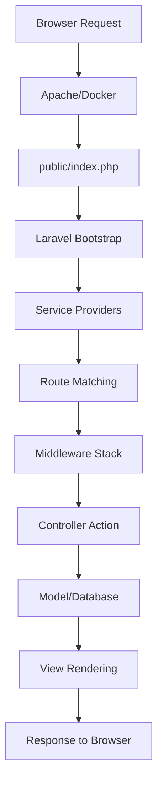
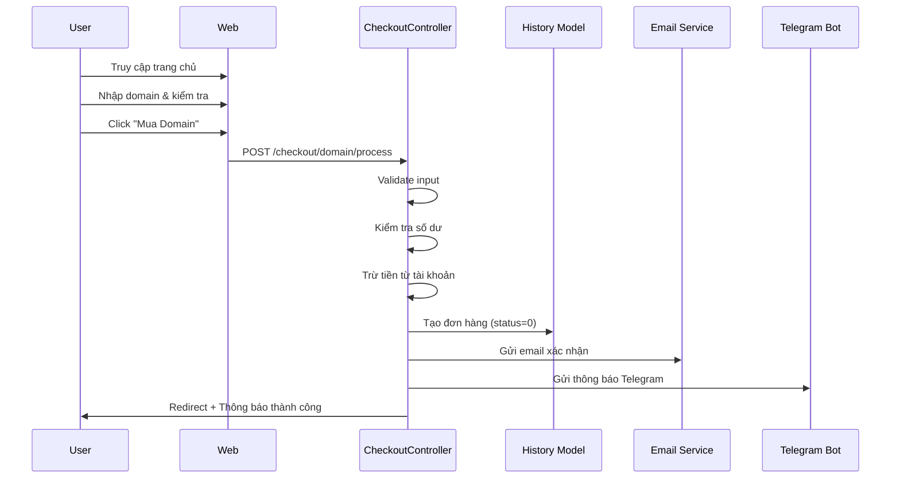

# 🚀 THANHVU.NET V4 - Hệ Thống Quản Lý Dịch Vụ Số

<div align="center">


**Hệ thống bán hàng dịch vụ số hiện đại - Domain, Hosting, VPS, Source Code**

[](https://opensource.org/licenses/MIT)
[](https://www.php.net/)
[](https://laravel.com/)

</div>

---

## 📋 Tổng Quan

**THANHVU.NET V4** là hệ thống quản lý và bán hàng dịch vụ số được xây dựng hoàn toàn bằng **Laravel Framework 10.10**. Hệ thống cung cấp đầy đủ tính năng quản lý cho cả người dùng và admin, với giao diện hiện đại, responsive và bảo mật cao.

### ✨ Tính Năng Nổi Bật

- 🛒 **Bán 4 loại dịch vụ**: Domain, Hosting, VPS, Source Code
- 💳 **Thanh toán tự động**: Nạp tiền bằng thẻ cào (CardVIP API)
- 📧 **Email tự động**: Xác nhận đơn hàng, reset password
- 🤖 **Telegram Bot**: Thông báo đơn hàng, quản lý qua bot
- 🔐 **Bảo mật cao**: CSRF protection, Session management, Admin middleware
- 📱 **Responsive Design**: Hỗ trợ tốt trên mobile và tablet
- 🎨 **Giao diện hiện đại**: Bootstrap 5 (Public) + Tailwind CSS (Admin)

---

## 🛠️ Công Nghệ Sử Dụng

### Backend


- **Framework:** Laravel 10.10
- **Ngôn ngữ:** PHP 8.2
- **Database:** MySQL 8.0
- **ORM:** Eloquent ORM
- **Template Engine:** Blade

### Frontend


- **Public Pages:** Bootstrap 5.x (Metronic Template)
- **Admin Pages:** Tailwind CSS (Adminstators Template)
- **JavaScript:** jQuery 3.2.1, AJAX
- **Icons:** Lucide Icons

### Infrastructure & Integration


- **Container:** Docker & Docker Compose
- **Web Server:** Apache 2.4
- **Email:** Laravel Mail (SMTP)
- **Telegram Bot:** Webhook API
- **Payment Gateway:** CardVIP API

---

## 📊 ERD - Entity Relationship Diagram

```mermaid
erDiagram
    USERS ||--o{ HISTORY : "has many"
    USERS ||--o{ HOSTINGHISTORY : "has many"
    USERS ||--o{ VPSHISTORY : "has many"
    USERS ||--o{ SOURCECODEHISTORY : "has many"
    USERS ||--o{ CARDS : "has many"
    USERS ||--o{ FEEDBACK : "has many"
    
    LISTHOSTING ||--o{ HOSTINGHISTORY : "has many"
    LISTVPS ||--o{ VPSHISTORY : "has many"
    LISTSOURCECODE ||--o{ SOURCECODEHISTORY : "has many"
    
    USERS {
        bigint id PK
        string taikhoan "username"
        string matkhau "MD5 password"
        string email
        integer tien "balance"
        integer chucvu "0=user, 1=admin"
        string time "registration time"
    }
    
    LISTDOMAIN {
        bigint id PK
        string duoi "domain extension"
        integer price
        string image
    }
    
    LISTHOSTING {
        bigint id PK
        string name
        integer price_month
        integer price_year
        text description
        text specs
        string image
        string time
    }
    
    LISTVPS {
        bigint id PK
        string name
        integer price_month
        integer price_year
        text description
        text specs
        string image
        string time
    }
    
    LISTSOURCECODE {
        bigint id PK
        string name
        integer price
        text description
        string file_path
        string download_link
        string image
        string category
        string time
    }
    
    HISTORY {
        bigint id PK
        bigint uid FK "user_id"
        string domain
        string ns1 "nameserver 1"
        string ns2 "nameserver 2"
        integer hsd "expiry years"
        integer status "0=pending, 1=approved, 2=rejected"
        string mgd "transaction_id"
        string time
        string timedns "DNS update time"
        integer ahihi "DNS update flag"
    }
    
    HOSTINGHISTORY {
        bigint id PK
        bigint uid FK "user_id"
        bigint hosting_id FK
        string period "month/year"
        string mgd "transaction_id"
        integer status "0=pending, 1=approved"
        string time
    }
    
    VPSHISTORY {
        bigint id PK
        bigint uid FK "user_id"
        bigint vps_id FK
        string period "month/year"
        string mgd "transaction_id"
        integer status "0=pending, 1=approved"
        string time
    }
    
    SOURCECODEHISTORY {
        bigint id PK
        bigint uid FK "user_id"
        bigint source_code_id FK
        string mgd "transaction_id"
        integer status "0=pending, 1=approved"
        string time
    }
    
    CARDS {
        bigint id PK
        bigint uid FK "user_id"
        string pin "card pin"
        string serial "card serial"
        string type "VIETTEL/VINAPHONE/etc"
        string amount "card value"
        string requestid "API request ID"
        integer status "0=pending, 1=success, 2=failed"
        string time
        string time2
        string time3
    }
    
    FEEDBACK {
        bigint id PK
        bigint uid FK "user_id"
        string username
        string email
        text message
        text admin_reply
        integer status "0=pending, 1=replied, 2=read"
        string telegram_chat_id
        string time
        string reply_time
    }
    
    CAIDATCHUNG {
        bigint id PK
        string tieude "website title"
        string theme
        text keywords
        text mota "description"
        string imagebanner
        string sodienthoai "phone"
        string banner
        string logo
        string webgach "favicon"
        string apikey "CardVIP API key"
        string callback "callback URL"
        string facebook_link
        string zalo_phone
        string telegram_bot_token
        string telegram_admin_chat_id
    }
```

<div align="center">



**12 Bảng Nghiệp Vụ** | **3 Bảng Hệ Thống Laravel** (migrations, password_resets, personal_access_tokens)

</div>

---

## 📁 Cấu Trúc Dự Án

```
domain/
├── app/                              # Core Application
│   ├── Http/Controllers/             # Controllers (25+)
│   │   ├── Admin/                    # Admin Controllers (12)
│   │   │   ├── AuthController.php
│   │   │   ├── DashboardController.php
│   │   │   ├── DomainController.php
│   │   │   ├── HostingController.php
│   │   │   ├── VPSController.php
│   │   │   ├── SourceCodeController.php
│   │   │   ├── OrderController.php
│   │   │   ├── DnsController.php
│   │   │   ├── UserController.php
│   │   │   ├── FeedbackController.php
│   │   │   ├── CardController.php
│   │   │   └── SettingsController.php
│   │   ├── Api/                      # API Controllers
│   │   │   └── AjaxController.php
│   │   └── ...                       # Public Controllers (13)
│   ├── Models/                       # Eloquent Models (12)
│   │   ├── User.php
│   │   ├── Domain.php
│   │   ├── Hosting.php
│   │   ├── VPS.php
│   │   ├── SourceCode.php
│   │   ├── History.php
│   │   ├── HostingHistory.php
│   │   ├── VPSHistory.php
│   │   ├── SourceCodeHistory.php
│   │   ├── Card.php
│   │   ├── Feedback.php
│   │   └── Settings.php
│   ├── Services/                     # Business Logic Services
│   │   ├── DomainService.php
│   │   ├── PaymentService.php
│   │   └── TelegramService.php
│   ├── Mail/                         # Email Classes
│   │   ├── OrderConfirmationMail.php
│   │   └── ForgotPasswordMail.php
│   └── Helpers/                      # Helper Functions
│       └── Helper.php                # fixImagePath(), getFileUrl()
├── resources/views/                  # Blade Templates (50+)
│   ├── layouts/                      # Layouts
│   │   ├── app.blade.php             # Public Layout (Bootstrap)
│   │   └── admin.blade.php           # Admin Layout (Tailwind)
│   ├── pages/                        # Public Pages
│   │   ├── home.blade.php
│   │   ├── profile.blade.php
│   │   ├── manager.blade.php
│   │   ├── checkout/                # Checkout Pages
│   │   ├── recharge.blade.php
│   │   ├── feedback.blade.php
│   │   └── ...
│   ├── admin/                        # Admin Pages
│   │   ├── dashboard.blade.php
│   │   ├── domain/                   # CRUD Pages
│   │   ├── hosting/
│   │   ├── vps/
│   │   ├── sourcecode/
│   │   └── ...
│   └── emails/                       # Email Templates
├── routes/                           # Route Definitions
│   ├── web.php                       # Web Routes (136 routes)
│   └── api.php                       # API Routes
├── database/                         # Database
│   ├── migrations/                   # Migrations (12 migrations)
│   └── tenmien.sql                   # Database Dump
├── public/                           # Public Directory
│   ├── images/                       # Images (domain, hosting, vps, sourcecode)
│   └── storage/                       # Storage Symlink
├── docker-compose.yml                # Docker Configuration
└── .env                              # Environment Configuration
```

---

## 🔄 Luồng Hoạt Động

### Request Flow



### Mua Domain Flow



---

## 🎯 Chức Năng Chính

### 👥 Phần Người Dùng (Public)

| Chức Năng | Mô Tả |
|-----------|-------|
| 🏠 **Trang Chủ** | Kiểm tra domain (WHOIS), hiển thị danh sách domain |
| 🔐 **Xác Thực** | Đăng ký, đăng nhập, quên mật khẩu, reset password |
| 👤 **Profile** | Xem thông tin, cập nhật profile, thống kê đơn hàng |
| 🛒 **Mua Dịch Vụ** | Domain, Hosting, VPS, Source Code |
| 💳 **Thanh Toán** | Nạp tiền bằng thẻ cào (CardVIP API) |
| 📝 **Phản Hồi** | Gửi phản hồi, xem phản hồi từ admin |
| 💬 **Tin Nhắn** | Nhận tin nhắn từ admin |
| 📥 **Tải Xuống** | Download source code đã mua |
| 🌐 **Quản Lý DNS** | Cập nhật DNS records cho domain |

### 🔧 Phần Quản Trị (Admin)

| Module | Chức Năng |
|--------|-----------|
| 📊 **Dashboard** | Thống kê doanh thu, đơn hàng, thành viên |
| 🌐 **Quản Lý Domain** | CRUD domain, quản lý giá |
| 🖥️ **Quản Lý Hosting** | CRUD gói hosting, upload ảnh |
| 💻 **Quản Lý VPS** | CRUD gói VPS, upload ảnh |
| 📦 **Quản Lý Source Code** | CRUD source code, upload file |
| 📋 **Quản Lý Đơn Hàng** | Duyệt/từ chối đơn hàng, hoàn tiền |
| 🌐 **Quản Lý DNS** | Duyệt/từ chối yêu cầu cập nhật DNS |
| 👥 **Quản Lý Thành Viên** | CRUD user, quản lý số dư |
| 💬 **Quản Lý Phản Hồi** | Xem, trả lời phản hồi |
| 💳 **Quản Lý Thẻ Cào** | Duyệt thẻ cào, cộng tiền |
| ⚙️ **Cài Đặt** | Website, Telegram, Liên hệ, Payment |

---

## 🔗 Tích Hợp

### 🤖 Telegram Bot
- **Webhook:** `/telegram/webhook`
- **Chức năng:**
  - 📢 Thông báo đơn hàng mới
  - 💰 Thông báo nạp tiền
  - 💬 Thông báo phản hồi mới
  - 🌐 Thông báo cập nhật DNS
  - 📋 Menu quản lý qua bot (xem feedback, thống kê, cộng tiền, cập nhật DNS)

### 💳 Payment Gateway (CardVIP)
- **API:** CardVIP API
- **Chức năng:**
  - Nạp tiền bằng thẻ cào
  - Tự động xác thực thẻ
  - Callback tự động

### 📧 Email System (SMTP)
- **Chức năng:**
  - ✅ Email xác nhận đơn hàng
  - 🔑 Email reset password
  - 📬 Email thông báo

---

## 🚀 Cài Đặt Nhanh

### Yêu Cầu Hệ Thống
- 🐳 Docker & Docker Compose
- 📦 Git
- 💾 RAM tối thiểu: 2GB (khuyên dùng 4GB+)

### Quick Start

```bash
# 1. Clone repository
git clone https://github.com/cho123nm/VTKT-domain-services.git
cd VTKT-domain-services

# 2. Cấu hình environment
cp .env.example .env
# Sửa file .env với thông tin của bạn

# 3. Khởi động Docker
docker-compose up -d

# 4. Setup Laravel
docker exec -it domain_app bash
composer install
php artisan key:generate
php artisan storage:link
chmod -R 775 storage bootstrap/cache
exit

# 5. Truy cập
# Website: http://localhost:8000
# Admin: http://localhost:8000/admin
# phpMyAdmin: http://localhost:8080
```

### Cấu Hình Quan Trọng

**File `.env`:**
```env
APP_NAME="THANHVU.NET V4"
APP_URL=http://localhost:8000

DB_CONNECTION=mysql
DB_HOST=db
DB_DATABASE=tenmien
DB_USERNAME=root
DB_PASSWORD=root

MAIL_MAILER=smtp
MAIL_HOST=smtp.gmail.com
MAIL_PORT=587
MAIL_USERNAME=your-email@gmail.com
MAIL_PASSWORD=your-app-password
MAIL_ENCRYPTION=tls
```

---

## 💻 Kiến Trúc Code

### Models & Relationships

```php
// User Model - Trung tâm của hệ thống
User::hasMany(History::class, 'uid')              // domainOrders
User::hasMany(HostingHistory::class, 'uid')      // hostingOrders
User::hasMany(VPSHistory::class, 'uid')          // vpsOrders
User::hasMany(SourceCodeHistory::class, 'uid')   // sourceCodeOrders
User::hasMany(Card::class, 'uid')                // cards
User::hasMany(Feedback::class, 'uid')            // feedbacks

// History Models - Quan hệ với sản phẩm
HostingHistory::belongsTo(Hosting::class, 'hosting_id')
VPSHistory::belongsTo(VPS::class, 'vps_id')
SourceCodeHistory::belongsTo(SourceCode::class, 'source_code_id')

// Lưu ý: History (Domain) không có FK đến ListDomain
// Chỉ lưu domain dạng string, không có domain_id
```

### Services Layer

| Service | Chức Năng |
|---------|-----------|
| **DomainService** | Logic nghiệp vụ domain (kiểm tra domain, tính giá, validate) |
| **PaymentService** | Logic thanh toán (xử lý thẻ cào, callback CardVIP, cộng tiền) |
| **TelegramService** | Tích hợp Telegram Bot (gửi thông báo, xử lý webhook, menu bot) |

### Middleware

- **AdminMiddleware**: Kiểm tra quyền admin (`chucvu = 1`)
- **VerifyCsrfToken**: Bảo vệ CSRF
- **Session Management**: Quản lý session cho AJAX requests (`$request->session()`)

### Helper Functions

- **fixImagePath()**: Chuyển đổi đường dẫn ảnh thành URL đúng định dạng
- **getFileUrl()**: Lấy URL công khai cho file đã upload (Storage)
- **random_string()**: Tạo chuỗi ngẫu nhiên

---

## 📊 Thống Kê

<div align="center">

| Metric | Value |
|--------|-------|
| **📊 Tổng số bảng** | 15 (12 nghiệp vụ + 3 Laravel) |
| **🎮 Tổng số Controllers** | 25+ |
| **📦 Tổng số Models** | 12 |
| **🛣️ Tổng số Routes** | 136+ |
| **🎨 Tổng số Views** | 50+ |
| **⚡ Tổng số chức năng** | 35+ |
| **🔗 Tổng số Relationships** | 9 |

</div>

---

## 🔐 Bảo Mật

- ✅ **CSRF Protection**: Tất cả form đều có CSRF token
- ✅ **Session Management**: Secure session handling
- ✅ **Admin Authorization**: Middleware kiểm tra quyền admin
- ✅ **Input Validation**: Validate tất cả input từ user
- ✅ **SQL Injection Prevention**: Sử dụng Eloquent ORM
- ✅ **Password Hashing**: MD5 (giữ nguyên từ code cũ)
- ✅ **Token Expiry**: Reset password token hết hạn sau 60 phút

---

## 📝 License

MIT License - Xem file [LICENSE](LICENSE) để biết thêm chi tiết.

---

## 👨‍💻 Tác Giả

**THANHVU.NET V4** - Hệ thống quản lý dịch vụ số hiện đại

---

<div align="center">

**⭐ Nếu project này hữu ích, hãy cho một star! ⭐**

Made with ❤️ using Laravel Framework


</div>
